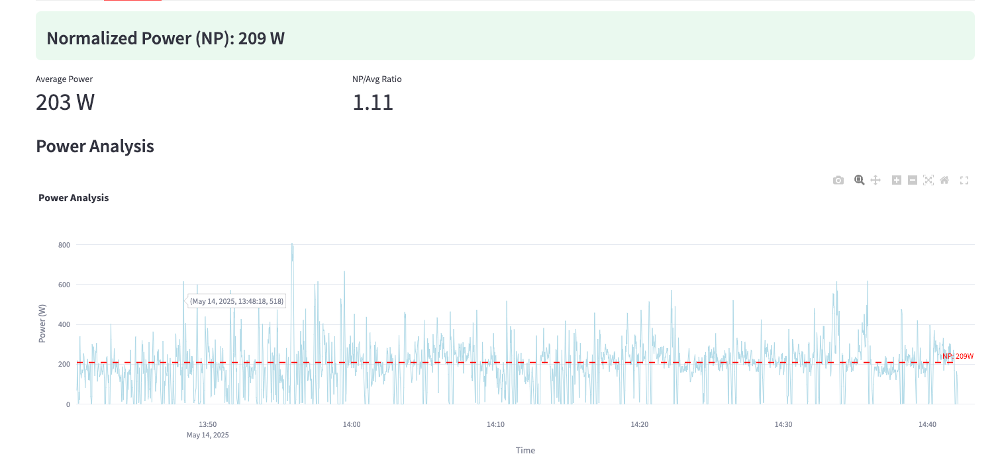

# 🚴‍♂️ 巡航速度计算




## Features

### 速度分析
- **巡航速度计算**：过滤掉加速、减速和停止等非巡航阶段
- **速度曲线可视化**：展示完整的骑行速度曲线，并标记巡航阶段
- **速度分布统计**：分析整体速度分布和仅巡航阶段的速度分布

### 功率分析
- **标准化功率(NP)计算**：实现标准的 30 秒滚动平均的 4 次方根算法
- **强度系数(IF)计算**：支持输入 FTP 计算 IF
- **功率曲线可视化**：展示瞬时功率、30 秒平均功率和标准化功率
- **功率分布统计**：分析整体功率分布特征

### 配置
- **速度分析参数**：停止速度阈值、最小巡航速度、加速度阈值等
- **高级速度参数**：停止持续时间、滚动窗口大小、速度标准差阈值因子
- **功率分析参数**：NP 窗口大小、FTP 设置
- **高级功率参数**：最大功率阈值、功率数据插值设置

### 安装步骤

1. 克隆仓库
```bash
git clone https://github.com/Equationzhao/cruising.git
cd cruising
```

2. 安装依赖
```bash
pip install -r requirements.txt
```

## 使用

1. 启动应用程序
```bash
streamlit run app.py
```

2. 在浏览器中打开

3. 使用界面
   - 在左侧边栏调整分析参数
   - 上传 FIT 格式文件
   - 点击"Analyze Ride Data"按钮进行分析
   - 查看"Speed Analysis"和"Power Analysis"选项卡中的结果